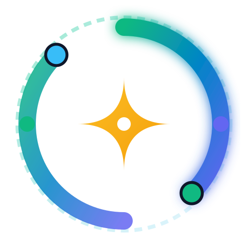

# 🎨 RotaFi Brand Guidelines & Asset Kit

Welcome to the official brand assets and design guidelines for **RotaFi** — transparent rotating savings on Stellar.

---

## 🌟 Brand Mark & Logo Vector Assets

| Logo Mark (SVG) | Dark Logo Mark | Icon Only |
|---|---|---|
|  |  |  |

- **Vector SVG Logo**: [`public/logo.svg`](./public/logo.svg)
- **High-Res PNG Logo**: [`public/logo.png`](./public/logo.svg)
- **Favicon Vector**: [`public/vite.svg`](./public/vite.svg)

---

## 🎨 Color Palette & Design System Tokens

RotaFi utilizes a curated, harmonious HSL color system optimized for high contrast, dark glassmorphism surfaces, and financial trust.

```css
/* Primary Brand Accents */
--brand-500: #10b981; /* Emerald Primary */
--brand-600: #059669; 
--brand-700: #047857;

/* Secondary Utility Accents */
--sapphire-500: #0284c7; /* Stellar Network Accent */
--indigo-500: #6366f1;   /* Smart Contract Accent */
--amber-500: #f59e0b;    /* Credit Trust Score & Bidding */

/* Dark & Light Surfaces */
--surface-dark: #090d16;  /* Deep Space Mesh */
--surface-card: #0f172a;  /* Glassmorphic Container */
--ink-900: #0f172a;       /* Primary Typography */
```

---

## 🔤 Typography & Font Specs

* **Display & Headings**: `Plus Jakarta Sans`, `Outfit` (Sans-serif, 700 / 800 Weight)
* **Body & UI Controls**: `Inter` (Sans-serif, 400 / 500 / 600 Weight)
* **Code & Addresses**: `JetBrains Mono`, `Fira Code` (Monospace, 500 Weight)

---

## 📸 Social OpenGraph Banners

- **Production OG Preview Image**: `https://rota-fi-omega.vercel.app/landing_page.png`
- **Twitter Card Preview**: `https://rota-fi-omega.vercel.app/landing_page.png`
